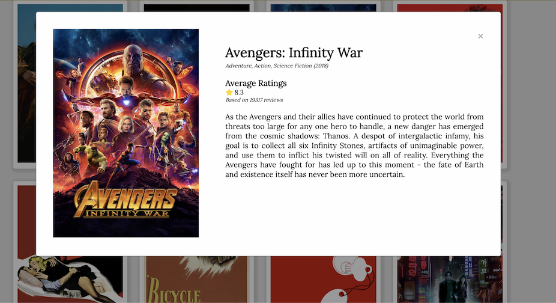

# Movie Review

## API
https://www.themoviedb.org/documentation/api

## Inside this App
  1. Web component using vanilla js
  2. Ajax (fetch) to make API request
  3. Simple infinite scrolling with vanilla js


## Requirements
This project requires you have [nodejs](https://nodejs.org/en/) with [npm](https://www.npmjs.com/get-npm) installed.

## Project Setup
```

# 1 Install all node packages
npm install

# 2 Get started
npm run start-dev

# 4 Build production
npm run build
```

## Preview



